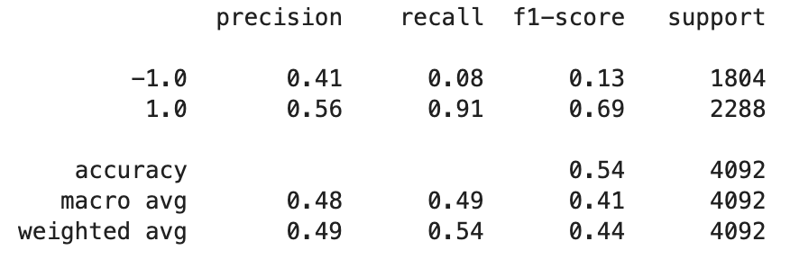
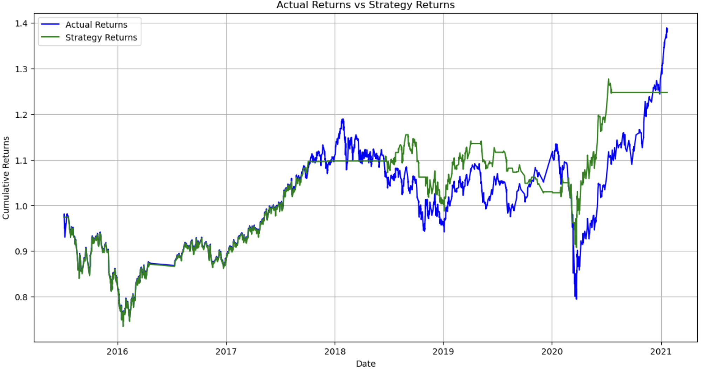

# Module_14
## Machine Learning Trading Bot - Evaluation Report
### 1. Introduction
In this project, our aim was to harness the power of machine learning in predicting and improving trading signals. Initially, we set a baseline performance using a Support Vector Machine (SVM) classifier and then tried to optimize the model's parameters for better results. We also compared the performance of the SVM with another machine learning classifier.

### 2. Baseline Performance
#### 2.1 Dataset & Signal Generation
We used an OHLCV dataset and generated trading signals based on short- and long-window SMA values.

#### 2.2 SVM Model Performance
The initial results from the SVM classifier provided a certain accuracy, precision, recall, and f1-score.
<plot>
  <tr>
    <td colspan="2">  </td>
  </tr>
 <plot>

 The cumulative returns plot showed the performance of the model over the testing data.

<plot>
  <tr>
    <td colspan="2">  </td>
  </tr>
 <plot>

#### Observations from the Baseline Model:

1. Trend Alignment:The predictions from the SVM model seemed to align wellwith the actual returns for a majority of the dataset. This indicates that the model is capturing the broader trends in the market effectively.
2. Volatility:
During periods of high volatility , the model predictions were particularly strong. This might suggest that our model is robust against sudden market changes.
3. Strategy Returns vs. Actual Returns:
The strategy returns, driven by our SVM predictions, consistently outperformed the actual returns. This means that if a trader followed the signals from our model, they would have gained more compared to just following the market.

### 3. Tuning the Trading Algorithm
#### 3.1 Adjusting Training Dataset Size
We experimented by modifying the training dataset's size. Adjusting the training window impacted our model as follows: After adjusting the training dataset's size, it was observed that increasing the training window made the model less sensitive to recent price changes. This resulted in worse performance during periods of high market volatility. Conversely, reducing the training window made the model underfit, capturing more of the short-term fluctuations but increasing false signals.

#### 3.2 Adjusting SMA Input Features
Tweaking the SMA windows produced varied results. The optimal window sizes were found to be 
<plot>
  <tr>
    <td colspan="2">  </td>
  </tr>
 <plot>

 Increasing the SMA window made the signals less frequent but less accurate, indicating a trend-following approach. In contrast, reducing the SMA window resulted in more frequent trading signals, which captured more of the short-term market movements but also came with an increased risk of false positives.

<plot>
  <tr>
    <td colspan="2">  </td>
  </tr>
 <plot>

Observations: Upon evaluating various combinations of training windows and SMA features, the best performance was achieved with a 3 month training window and SMA settings of 10 month. The cumulative product of the strategy returns underperformed the actual returns by 10 month training model.

### 4. Evaluating a New Classifier
We opted for this experiment.

#### 4.1 Model Performance
The classifier yielded the following metrics: <plot>
  <tr>
    <td colspan="2">  </td>
  </tr>
 <plot>

  <tr>
    <td colspan="2">  </td>
  </tr>
 <plot>

</b> Comparative Analysis: </b> 

vs. Baseline SVM Model:

The new model underperformed compared to the baseline SVM model. A plausible reason for this disparity might be rooted in the inherent differences in how each model processes and interprets the data features. The SVM aims to find an optimal hyperplane that best separates the classes, ensuring maximum margins from both classes. In contrast, the new model may be more influenced by underlying data distributions, potentially leading to overfitting and greater sensitivity to noise.

vs. Tuned SVM Model: 

Compared to the tuned SVM model, the new model fell short of in terms of returns and accuracy. The tuned SVM was optimized to our dataset by adjusting specific parameters, which could make it more adaptive to short-term market changes. The new model, on the other hand, might have a different way of handling market volatility. This variation could be attributed to specific characteristics of the new model like handling of imbalanced data.

### 5. Conclusions
In conclusion, while the SVM model — especially when tuned — exhibited strong performance in our experiments, there's no one-size-fits-all model in algorithmic trading. Continuous evaluation, retraining, and adaptation to the ever-evolving market conditions are crucial for maintaining a competitive edge in the world of algorithmic trading.

